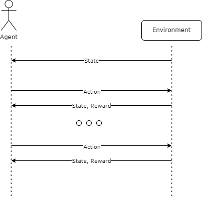
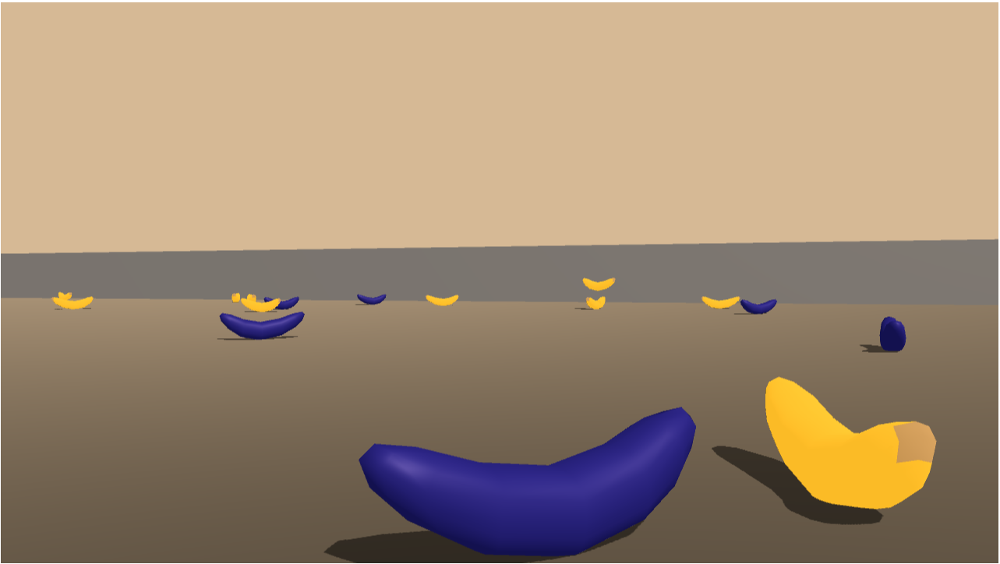

# Going Bananas with RL!

## Introduction

Reinforcement Learning is one of the big branches in AI that focuses on an agent that interacts 
with an environment and tries to maximize an arbitrary internal function by choosing the appropriate
actions. After each interaction the agent learns a new state of the environment and perceives a 
possible reward.



## Environment

In this exercise the Environment is given by a rectangular 3D world that has two types of bananas
in it: blue and yellow. 



The agent receives a positive reward each time it grabs a yellow banana and a negative 
reward each times it grabs a blue one. Additionally, the agent is given a time limit for this. 
The agent can interact with the environment taking one of four actions:

1. Move forward
2. Move backward
3. Turn left
4. Turn right

Each event where the agent starts interacting with the environment until the time ends
it's called an **episode**. With this, the main goal is to write an agent that can learn
from this interaction with the environment and to maximize the amount of yellow bananas it can
grab before the episode ends. To this end, the following conditions should be met:


* The agent has not prior knowledge of the environment before the start of the first episode. This includes:
  * No information as to what each action does
  * No preconceptions about what happens when it grabs a yellow or blue banana
  * No inherent understanding as to how the information is encoded in the environment **state**
* The environment is considered *solved* if the agent manages to get an average reward of +13 after 100 episodes.

## How to run the agent

To run and train the agent that solves the environment a `conda` installation is recommended. 
Installing the dependencies requires the following command:

``` sh
conda env create -f environment.yml
```

This will create a new conda environment named `drlnd` and automatically install
all the required packages within it. Then, run the following commands to activate
the environment and open the Jupyter interface:

```sh
conda activate drlnd
jupyter notebook
```

If a web browser window is not open automatically the output of the command should show a URL
that can be copied and pasted in a web browser. On this interface
select `Navigation.ipynb` to see the results, or run it to train the agents from scratch.

