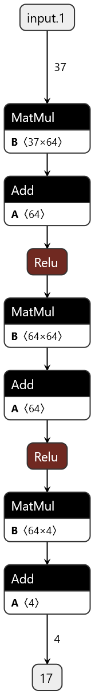
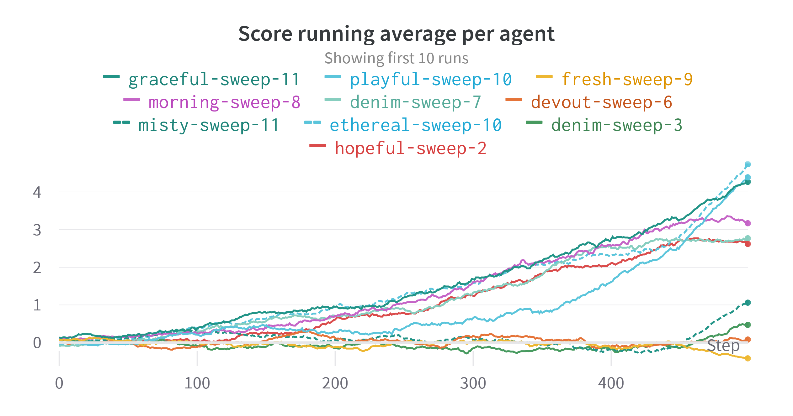
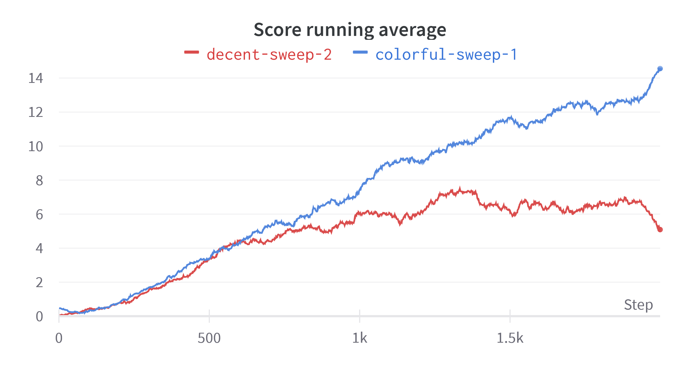
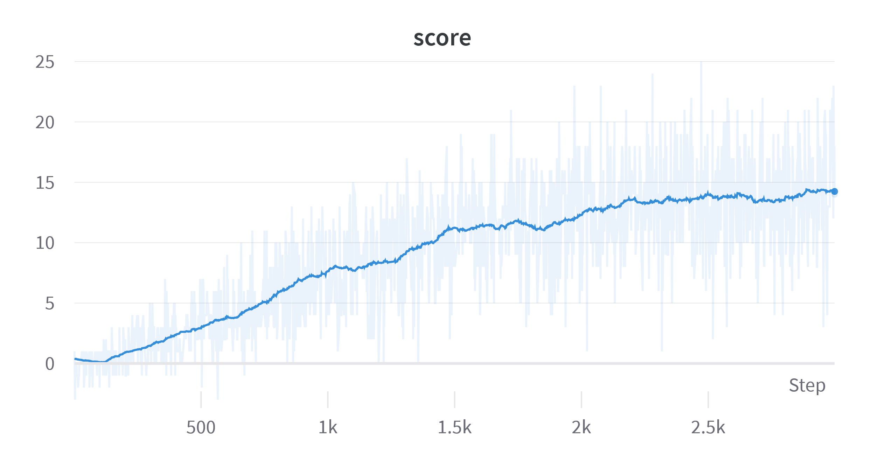
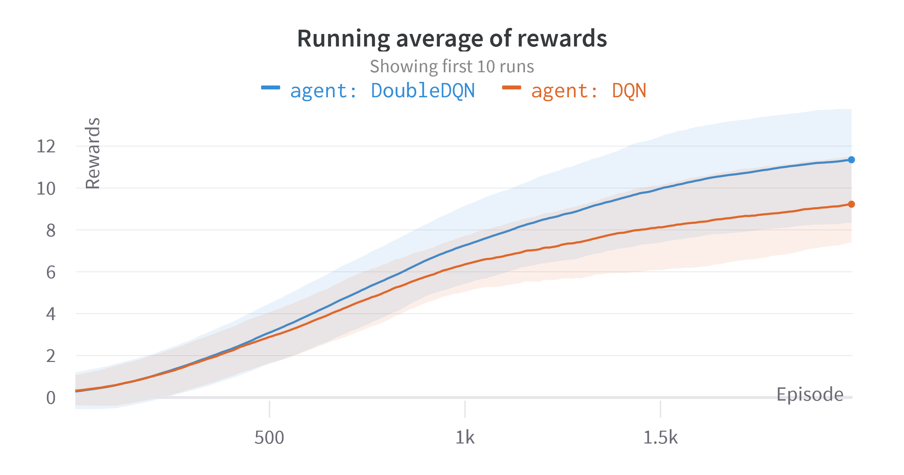

# Solving the Banana Environment

By: Jorge L. Martínez

## Learning algorithm

The learning agent is faced with a space that has continuous dimensions, which would mean that it is not
feasible to use tabular methods to train it, as the number of different states would be too big (or infinite)
to solve efficiently. This way a value-based method is required. 

For this project, the Deep Q-Learning method was used as discussed in [Human-level control through deep reinforcement learning](https://www.nature.com/articles/nature14236).
Additionally, the algorithm was fitted to follow the elements described in [Deep Reinforcement Learning with Double Q-Learning](https://arxiv.org/abs/1509.06461v3).

The main idea behind these papers is to leverage the use of neural networks to approximate the action-value function:

$$
q_\pi(s, a) \doteq \mathbb{E} \lbrack G_t | S_t=s, A_t=a \rbrack \; \forall \; s \in \mathcal{S} \land a \in \mathcal{A}(s)
$$

But, because the number of states is too big, the function is approximated via an extra parameter $ \theta $. So, the function being approximated looks like:

$$ Q_\pi(s, a, \theta) \approx q_\pi(s, a) \; \mathrm{where} \; \| \theta \| \llless \| \mathcal{S} \| $$ 

To make the most out of training and inference, the neural network should calculate all the action-value functions for the whole 
action space. This means, given a state $ s \in \mathcal{S} $ we would like to
get the approximate value for all $ a \in \mathcal{A}(s) $ in a single call.
For this purpose, the neural network should have an input as big as the state space
(37 values) and an output as big as the action space (4 values). 

### Double DQN explained

To understand the algorithm being used we have to start with the formula for Q-Learning:

$$ Q(S_t, A_t, \theta) \gets Q(S_t, A_t, \theta) + \alpha \lbrack R_{t+1} + \gamma \, \mathrm{max}_a Q(S_{t+1}, a, \theta) - Q(S_t, A_t, \theta) \rbrack $$

The agent tries to approximate de action-value of a given state based on the action-value of the "best" next state.
This "best" is given by the action that provides the highest action-value.

With Deep Q-Learning (DQN), a neural network is used to approximate this value. Nonetheless, from the insight given in the
first paper mentioned, the use of two neural networks is proposed (both with the same architecture): **target** and **local**. The intuition
for this is that value that is bootstraped, from $ Q(S_{t+1}, a) $, becomes a moving target if at the same time the network is
being updated. Each time that a neural network is updated the action-value inference is updated for several states,
making learning unstable. By separating the neural network that is being updated from the one that makes the inference it is possible
to help to training convergence.

$$ Q(S_t, A_t, \theta) \gets Q(S_t, A_t, \theta) + \alpha \lbrack R_{t+1} + \gamma \, \mathrm{max}_a Q(S_{t+1}, a, \theta^-) - Q(S_t, A_t, \theta) \rbrack $$

The network using the $ \theta^- $ is the target network, while the one being updated is the local network. After each full learning step
from the local network the target network would be updated with the weights. A factor $ \tau $ is proposed to soften the weight copying
followint this formula:

$$ \theta^- \gets \tau \theta + (1-\tau) \theta^- $$

Then, the network wouldn't learn directly from each experience but would store the interactions in a memory buffer. Every n steps the
agent would take a sample from this memory and apply the learning algorithm to the local neural network. Both the size of the memory
buffer and the size of the sample (batch) are additional parameters to tweak.

Finally, the Double DQN paper proposes the further separation in the actual $ \mathrm{max}_a Q(...) $ in the two parts that compose it:

- Selecting $ a $ that follows $ \mathrm{argmax}_a Q(s, a, \theta) $
- Then getting the value of $ a $ from the network

So, the final formula looks like:

$$
Q(S_t, A_t, \theta) \gets Q(S_t, A_t, \theta) + \alpha \lbrack R_{t+1} + \gamma \, Q(S_{t+1}, \mathrm{argmax}_a(S_{t+1}, a, \theta), \theta^-) - Q(S_t, A_t, \theta) \rbrack 
$$

## Training

Training was performed using the Unity ML environment for Banana pickup, there are two bananas: blue and yellow. The environment
positively rewards for picking up a yellow banana and negatively rewards for picking a blue banana. 

The hyperparameters that can be tweaked are:
- \# of episodes to train for
- $ \gamma $ : discount factor
- $ \alpha $ : learning rate
- $ \tau $ : Weight softening when copying between target and local networks
- batch_size : How big a sample to take from the memory buffer
- buffer_size : Memory buffer size
- learn_every : How many steps to wait before doing a learning step
- algorightm: DQN vs Double DQN

For this [Weights & Biases](https://wandb.ai) was used to control the hyperparameter selection and tweaking. For the first run several
agents were trained for 500 steps, taking the best for the longer run sweep. These are the results of this first run:

The best agents were selected to perform a running step during 2000 steps, getting to these results:

Finally, the best agent was trained for 3000 steps, getting to an agent that was able to solve the environment:

Which used the following hyperparameter settings:

| Hyperparameter | Value |
| - | - |
| algorithm | DoubleDQN |
| $ \gamma $ | 0.91 |
| $ \alpha $ | 0.0005 |
| $ \tau $ | 0.001 |
| batch_size | 64 |
| buffer_size | 10000 |
| learn_every | 11 |

## Ideas for future work

Both $ \gamma $ and $ \alpha $ were the hyperparameters that showed the biggest change in training convergence 
in the algorithm. Nonetheless, it was clear that DoubleDQN was better in general than DQN, as can be seen in this
graph:

Other papers describe additional techniques that could help on achieving higher scores faster. I believe that
the paper on [prioritized experience replay](https://arxiv.org/abs/1511.05952v4) would be the easiest next step that might have 
the greatest impact on learning.

Each time the agent was trained it took a long time, taking into account 
that the agent that finally solved the environment required more that 2k steps to learn.
An approach like [noisy networks for exploration](https://arxiv.org/abs/1706.10295v3) could make
the most out of the exploration steps and aid the agent into learning a good
policy faster.
